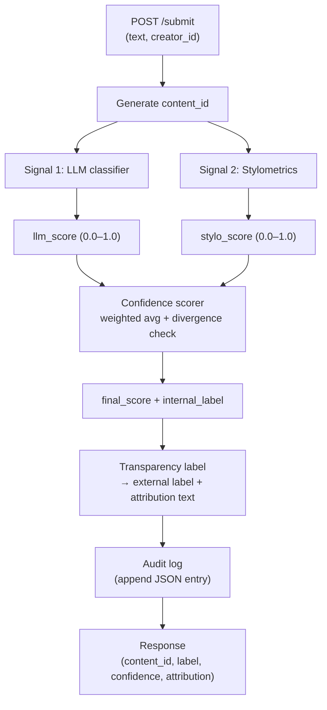
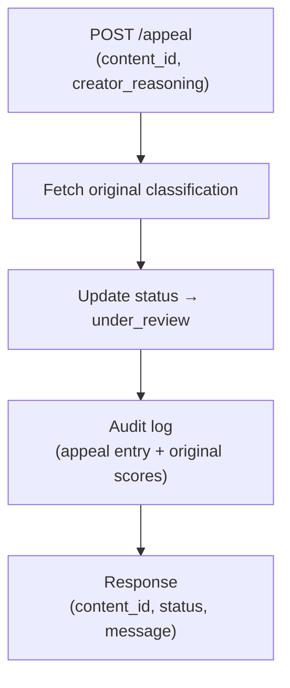

# Provenance Guard — planning.md

**Student:** Quonlee Howery · qhowery@princeton.edu  
**Project:** AI201 Project 4 — Provenance Guard  
**Milestone 1:** Architecture & design (no code yet)

---

## Required features (7)

| # | Feature | Role |
|---|---------|------|
| 1 | **`POST /submit`** | Accept text + creator, run the pipeline, return label |
| 2 | **Detection Signal 1 — LLM classifier** | Holistic read of whether text feels AI-generated |
| 3 | **Detection Signal 2 — Stylometric heuristics** | Statistical shape of the writing (burstiness + punctuation entropy) |
| 4 | **Confidence scoring** | Combine both signals; detect disagreement → force uncertainty |
| 5 | **Transparency labels** | Map scores to plain-language attribution the user sees |
| 6 | **Audit log (`GET /log`)** | Append-only record of every classification and appeal |
| 7 | **`POST /appeal`** | Let creators challenge a label; move status to `under_review` |

---

## Architecture narrative: submission → label

A creator submits a poem, story excerpt, or blog post through **`POST /submit`**, sending `{ text, creator_id }`.

1. **Submission handler** validates the payload (non-empty text, creator present) and assigns a unique **`content_id`**. The raw text and creator are held in memory for this request.

2. **Signal 1 — LLM classifier** sends the text to Groq (`llama-3.3-70b-versatile`) with a structured prompt asking whether the writing reads as human or AI-generated. It returns **`llm_score`** ∈ [0.0, 1.0] where higher = more likely AI. This signal captures semantic patterns: safe word choice, flat tone, filler transitions, overly even structure.

3. **Signal 2 — Stylometric analyzer** runs pure-Python metrics on the same text without an LLM:
   - **Burstiness** (σ/μ of sentence lengths) — humans vary rhythm; AI tends toward uniform sentence length.
   - **Punctuation entropy** — humans use a messier mix of marks; AI often over-relies on commas/periods and underuses ellipses, exclamation marks, etc.  
   These combine into **`stylo_score`** ∈ [0.0, 1.0], higher = more likely AI.

4. **Confidence scorer** fuses the two signals:
   - Weighted average: **60% LLM + 40% stylometrics** (LLM carries richer meaning; stylometrics anchors obvious structural tells).
   - **Divergence check:** if `|llm_score − stylo_score| > 0.40`, the signals contradict each other → force **`final_score = 0.50`** (uncertain band). This prevents overconfident labels when only one signal fires.

5. **Label mapper** converts `final_score` to an **internal label** (5 tiers), then collapses to one of three **external labels** the user actually sees:
   - `high-confidence AI`
   - `high-confidence human`
   - `uncertain`

6. **Transparency label generator** turns the external label + score into a human-readable **`attribution`** string, e.g. *"This content was assessed as AI-generated (78% confidence)."*

7. **Audit logger** appends one JSON line: `content_id`, `creator_id`, timestamp, both signal scores, `final_score`, internal + external labels, `attribution`, status=`classified`.

8. **Response** returns `{ content_id, label, confidence, attribution }` to the platform, which displays the transparency label to end users.

---

## Detection signals (decided before code)

### Signal 1: LLM-based classification

| | |
|---|---|
| **Measures** | Holistic "does this read like AI?" judgment — word choice, structure, filler phrases, tone consistency |
| **Why it differs** | LLMs produce statistically fluent, hedged, evenly structured prose. Human drafts are messier: abrupt shifts, personal idioms, uneven pacing |
| **Blind spots** | Heavily edited AI passes as human; formal human writers (legal, academic) trigger AI-like patterns; short texts give the model too little context; model bias toward patterns in its training data, not ground truth |

### Signal 2: Stylometric heuristics (burstiness + punctuation entropy)

| | |
|---|---|
| **Measures** | Statistical regularity of sentence length and punctuation distribution |
| **Why it differs** | AI optimizes for smooth readability → low burstiness, narrow punctuation palette. Human writing is irregular by default |
| **Blind spots** | Short texts (<5–6 sentences) make burstiness unreliable; formal journalism/academic human writing is intentionally uniform; minimalist human style looks AI; genre constraints (screenplays, contracts) limit punctuation variety; AI punctuation fingerprints change as models evolve |

---

## False positive scenario

**Setup:** A human poet submits deliberate, polished free verse — short uniform lines, restrained punctuation, no slang.

**What happens:**
- LLM sees flat tone + predictable line structure → **`llm_score ≈ 0.80`**
- Stylometrics sees low burstiness + low punctuation entropy → **`stylo_score ≈ 0.75`**
- Signals agree → divergence check does **not** fire
- Weighted score ≈ **0.78** → internal label *clearly AI* → external label **`high-confidence AI`**
- User sees: *"This content was assessed as AI-generated (78% confidence)."* — **wrong**, but the system honestly reports high confidence because both signals aligned.

**How uncertainty should work:** If instead LLM said 0.80 but stylometrics said 0.25, divergence = 0.55 → **`final_score` forced to 0.50** → external label **`uncertain`**. Borderline cases get softer language; agreement gets stronger language — even when both are wrong.

**Appeal path:**
1. Creator calls **`POST /appeal`** with `{ content_id, creator_reasoning }`.
2. System fetches the original classification, sets status → **`under_review`**.
3. Audit log records the appeal: original scores, label, creator reasoning, timestamp.
4. Response: *"Appeal received — submission is under review."*
5. A human reviewer later uses **`GET /log`** to see full provenance and override if needed (stretch / manual step).

This false-positive story drives Milestone 2 decisions: symmetric thresholds around 0.5, three external labels only, and appeals for any label — not just AI flags.

---

## Score → label mapping

```
Internal tiers (symmetric around 0.5):
  ≥ 0.82  clearly AI
  ≥ 0.65  borderline AI
  ≥ 0.35  uncertain
  ≥ 0.18  borderline human
  < 0.18  clearly human

External labels (what users see):
  clearly AI              → high-confidence AI
  borderline AI           → uncertain
  uncertain               → uncertain
  borderline human        → uncertain
  clearly human           → high-confidence human
```

**Attribution templates:**
- **high-confidence AI:** `"This content was assessed as AI-generated ({pct}% confidence)."`
- **high-confidence human:** `"This content was assessed as human-written ({pct}% confidence)."`
- **uncertain:** `"This content could not be confidently attributed ({pct}% confidence). Attribution is uncertain."`

---

## API surface (contract)

### `POST /submit`

**Request**
```json
{
  "text": "string — content to classify (required, min ~20 chars)",
  "creator_id": "string — submitter identifier (required)"
}
```

**Response 200**
```json
{
  "content_id": "uuid",
  "label": "high-confidence AI | high-confidence human | uncertain",
  "confidence": 0.78,
  "attribution": "This content was assessed as AI-generated (78% confidence)."
}
```

**Response 422** — empty text, missing fields, or pipeline error
```json
{ "error": "description of what failed" }
```

---

### `POST /appeal`

**Request**
```json
{
  "content_id": "uuid from /submit response",
  "creator_reasoning": "string — why the creator believes the label is wrong"
}
```

**Response 200**
```json
{
  "content_id": "uuid",
  "status": "under_review",
  "message": "Appeal received and is under review."
}
```

**Response 422** — unknown `content_id`, duplicate appeal, or missing fields

---

### `GET /log`

**Response 200** — array of audit entries, newest first
```json
[
  {
    "content_id": "uuid",
    "creator_id": "string",
    "timestamp": "ISO-8601",
    "llm_score": 0.81,
    "stylo_score": 0.56,
    "confidence": 0.78,
    "internal_label": "clearly AI",
    "label": "high-confidence AI",
    "attribution": "...",
    "status": "classified | under_review"
  }
]
```

Appeal entries add: `creator_reasoning`, `appeal_timestamp`, original label preserved.

---

## Architecture diagrams

### Flow 1 — Submission



### Flow 2 — Appeal



---

## Milestone 1 checkpoint

- [x] Read required features list
- [x] Architecture narrative (submission → label)
- [x] Two detection signals chosen with blind spots documented
- [x] False positive traced through scoring, label, and appeal
- [x] API contract sketched (`/submit`, `/appeal`, `/log`)
- [x] Architecture diagrams for both flows

**Next:** Milestone 2 — finalize thresholds, test cases, and evaluation plan before writing code.
